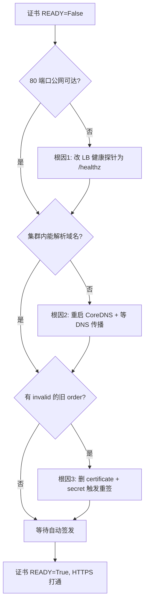

# HTTPS 证书签发排障指南

部署时设置了 `LITELLM_HOSTNAME` + `LETSENCRYPT_EMAIL` 后，脚本会自动装 ingress-nginx + cert-manager 并用 Let's Encrypt 签发证书。若证书迟迟 `READY=False` / `https` 打不开，多半是下面**三个叠加问题**之一，按顺序排查即可。

> 本文基于实际部署踩坑整理，客户环境很可能遇到相同问题。

---

## 快速自检

```powershell
# 证书状态（READY 应为 True）
kubectl get certificate -n litellm

# 看证书为什么没签发成功
kubectl describe certificate litellm-tls -n litellm
kubectl get certificaterequest,order,challenge -n litellm

# 从公网测 80 端口是否可达（HTTP-01 验证走 80）
Test-NetConnection <ingress公网IP> -Port 80
```

如果 80 端口 `TcpTestSucceeded=False`，直接看**根因 1**。

---

## 根因 1（最常见，最关键）：Azure 负载均衡器健康探针路径错误

### 现象

- 外部 80/443 端口**超时**（`Test-NetConnection ... -Port 80` 失败）
- cert-manager 的 challenge 报 `Timeout during connect (likely firewall problem)`

### 原理

AKS 会根据 Service 端口的 `appProtocol`（http/https）自动生成 Azure LB 健康探针，**默认探测路径是 `/`**。但 ingress-nginx 对 `/` 返回 **HTTP 404**，Azure 认为后端不健康 → 把节点从负载均衡轮询里摘除 → 外部 80/443 全部超时 → Let's Encrypt 的 HTTP-01 验证连不上。

### 修复

给 ingress-nginx 的 Service 加注解，把探针指向 `/healthz`（ingress-nginx 对它返回 200）：

```
service.beta.kubernetes.io/azure-load-balancer-health-probe-request-path=/healthz
```

> ✅ **这个修复已固化进部署脚本** [`deploy_mi_aks_litellm.py`](deploy_mi_aks_litellm.py) 的 `install_ingress_nginx()`，用脚本全新部署不会再踩。以下命令用于**手动修复已存在的集群**（例如客户之前手动装过 ingress-nginx）：

```powershell
# 方式 A：直接给 service 打注解
kubectl annotate svc ingress-nginx-controller -n ingress-nginx `
  "service.beta.kubernetes.io/azure-load-balancer-health-probe-request-path=/healthz" --overwrite

# 方式 B：用 helm 重装时 --set（脚本采用的方式）
helm upgrade --install ingress-nginx ingress-nginx/ingress-nginx `
  --namespace ingress-nginx --create-namespace `
  --set controller.service.type=LoadBalancer `
  --set "controller.service.annotations.service\.beta\.kubernetes\.io/azure-load-balancer-health-probe-request-path=/healthz" `
  --wait --timeout 10m
```

加上后 80 端口应立刻 `TcpTestSucceeded=True`。

---

## 根因 2：CoreDNS 负缓存导致 cert-manager 自检失败

### 现象

- 80 端口已通，但 challenge 仍不通过
- cert-manager 日志提示解析主机名失败 / 自检拿不到预期结果

### 原理

cert-manager 做自检时走集群内 CoreDNS（上游是 Azure 解析器 `168.63.129.16`）。如果**先创建了 Ingress、后加的公网 DNS 记录**，之前的 NXDOMAIN 结果可能被 CoreDNS 负缓存，导致短时间内解析不到新记录。

### 修复

```powershell
# 清 CoreDNS 缓存
kubectl -n kube-system rollout restart deployment coredns

# 在集群内验证 DNS 是否已能解析（比在本机测更准）
kubectl run dnstest --rm -it --image=busybox --restart=Never -- nslookup <你的域名>
```

清完缓存后，还需等上游 DNS 传播（几分钟）。

> ⚠️ 企业网络常**屏蔽直接访问外部 DNS 服务器**（如 8.8.8.8），本机 `nslookup 8.8.8.8` 可能失败但不代表集群有问题。集群内 DNS 才是有意义的判断依据 —— 一定用上面的 `kubectl run` 在 Pod 内测。

---

## 根因 3：残留的失效 ACME order 不会自动重试

### 现象

- 前两个问题都修好了，但证书还是 `READY=False`
- `kubectl get order -n litellm` 里有 `invalid` / `errored` 状态的旧 order

### 原理

前面失败留下的 ACME order 处于失效状态，cert-manager 不会自动基于它重签，需要触发一次全新的签发流程。

### 修复

删掉证书和 TLS secret，ingress-shim 会自动重新创建全新的 order：

```powershell
kubectl delete certificate litellm-tls -n litellm
kubectl delete secret litellm-tls -n litellm

# 观察重新签发（READY 变 True 即成功）
kubectl get certificate -n litellm -w
```

---

## 完整排查顺序



一句话：**修探针（端口通）→ 清 CoreDNS（能解析）→ 删旧证书（触发重签）→ 签发成功**。

其中**只有根因 1 进了脚本**（每次新部署都会遇到的结构性问题）；根因 2、3 属于一次性排障操作，遇到再处理。

---

## 前置条件提醒（MCAPS 沙箱订阅）

若 AKS 集群卡在 `Creating` 且报 `SubscriptionNotRegisteredForFeature`，需要先注册按需公网 IP 特性：

```powershell
az feature register --namespace Microsoft.Network --name AllowBringYourOwnPublicIpAddress
az provider register -n Microsoft.Network
# 等 feature 状态变 Registered 后再重建集群
az feature show --namespace Microsoft.Network --name AllowBringYourOwnPublicIpAddress --query properties.state -o tsv
```
